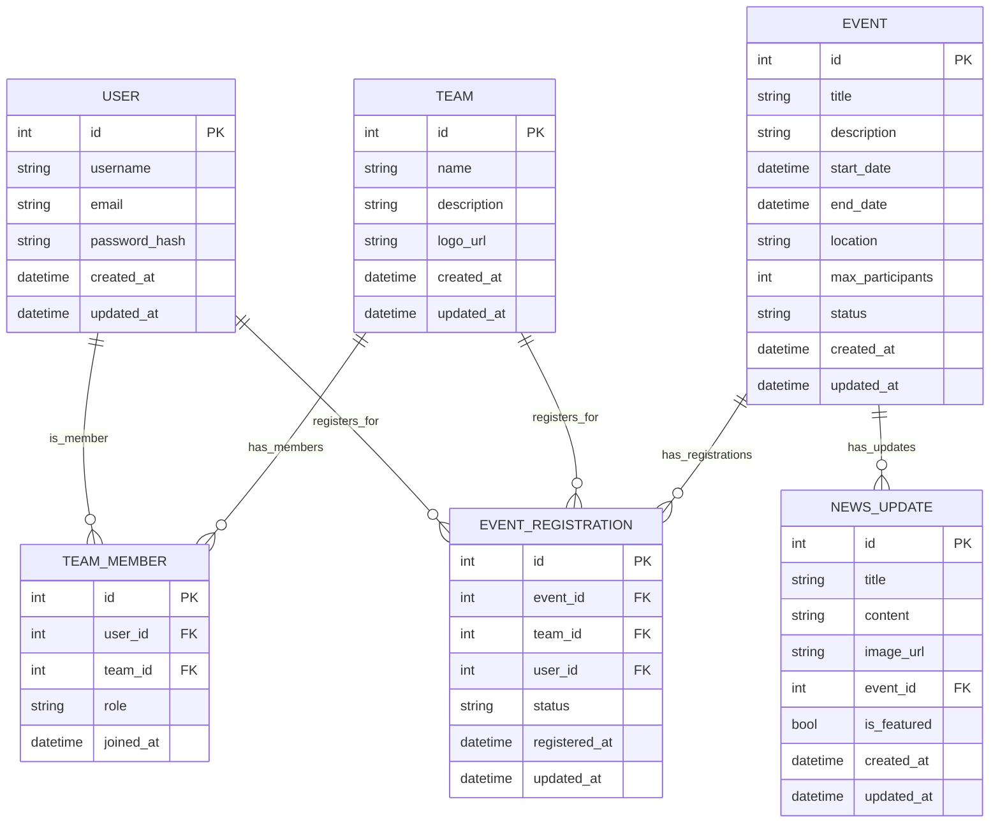

# Database Schema Documentation

This document provides a comprehensive overview of the database structure for the Robo Events Platform.

## Entity Relationship Diagram (ERD)



## Data Dictionary

### Users
| Column | Type | Description |
|--------|------|-------------|
| id | SERIAL | Primary key |
| username | VARCHAR(150) | Unique username |
| email | VARCHAR(254) | User's email address |
| password_hash | VARCHAR(128) | Hashed password |
| created_at | TIMESTAMP | When the user was created |
| updated_at | TIMESTAMP | When the user was last updated |

### Teams
| Column | Type | Description |
|--------|------|-------------|
| id | SERIAL | Primary key |
| name | VARCHAR(100) | Team name |
| description | TEXT | Team description |
| logo_url | VARCHAR(200) | URL to team logo |
| created_at | TIMESTAMP | When the team was created |
| updated_at | TIMESTAMP | When the team was last updated |

### Team Members
| Column | Type | Description |
|--------|------|-------------|
| id | SERIAL | Primary key |
| user_id | INTEGER | Reference to users.id |
| team_id | INTEGER | Reference to teams.id |
| role | VARCHAR(50) | Member's role in the team |
| joined_at | TIMESTAMP | When the user joined the team |

### Events
| Column | Type | Description |
|--------|------|-------------|
| id | SERIAL | Primary key |
| title | VARCHAR(200) | Event title |
| description | TEXT | Detailed description |
| start_date | TIMESTAMP | Event start time |
| end_date | TIMESTAMP | Event end time |
| location | VARCHAR(200) | Event location |
| max_participants | INTEGER | Maximum number of participants |
| status | VARCHAR(20) | Event status (upcoming, ongoing, completed, cancelled) |
| created_at | TIMESTAMP | When the event was created |
| updated_at | TIMESTAMP | When the event was last updated |

### Event Registrations
| Column | Type | Description |
|--------|------|-------------|
| id | SERIAL | Primary key |
| event_id | INTEGER | Reference to events.id |
| team_id | INTEGER | Reference to teams.id |
| user_id | INTEGER | Reference to users.id |
| status | VARCHAR(20) | Registration status (pending, confirmed, cancelled) |
| registered_at | TIMESTAMP | When the registration was created |
| updated_at | TIMESTAMP | When the registration was last updated |

### News Updates
| Column | Type | Description |
|--------|------|-------------|
| id | SERIAL | Primary key |
| title | VARCHAR(200) | News title |
| content | TEXT | News content |
| image_url | VARCHAR(200) | URL to featured image |
| event_id | INTEGER | Reference to events.id (optional) |
| is_featured | BOOLEAN | Whether this is a featured news item |
| created_at | TIMESTAMP | When the news was created |
| updated_at | TIMESTAMP | When the news was last updated |

## Migration Guide

### Creating Migrations

```bash
# Create a new migration
python manage.py makemigrations

# Apply migrations
python manage.py migrate
```

### Handling Schema Changes

1. **Adding a New Field**
   - Add the field to the model
   - Create and apply migrations
   - Update any affected views/serializers

2. **Removing a Field**
   - Remove the field from the model
   - Create and apply migrations
   - Update any code that referenced the field

3. **Renaming a Field**
   - Add the new field with a different name
   - Create a data migration to copy data from old to new field
   - Remove the old field in a subsequent migration

### Data Migrations

For complex data migrations, create a data migration:

```python
from django.db import migrations

def update_some_data(apps, schema_editor):
    MyModel = apps.get_model('myapp', 'MyModel')
    # Your data migration logic here

class Migration(migrations.Migration):
    dependencies = [
        ('myapp', 'previous_migration'),
    ]

    operations = [
        migrations.RunPython(update_some_data),
    ]
```

## Indexes

Consider adding indexes for frequently queried fields:
- Foreign key fields
- Fields used in WHERE clauses
- Fields used for ordering
- Fields used in JOIN operations

Example:
```python
class Meta:
    indexes = [
        models.Index(fields=['status'], name='event_status_idx'),
        models.Index(fields=['start_date'], name='event_start_date_idx'),
    ]
```
